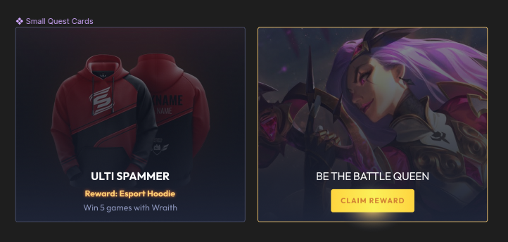

Assignment for the Frontend Developer Junior (React + Storybook) interview.

# Assignment tasks
Your task is to implement the following "Quest card" as a component in Storybook.

## QuestCard component

Figma design:
[Figma design](https://www.figma.com/file/0fXr6glMSibZrNcPUe47Sh/Omnicoach-Frontend-Testing-task?node-id=0%3A1)

### Component Description
- States:
  - Incomplete, complete
- Attributes:
  - Name (shown in all states)
  - Background image (shown in all states)
  - Description (shown in incomplete state only)
  - Reward (shown in incomplete state only)
  - Button title (show in complete state only)
- Interactions:
  - click interaction on whole card
  - IF state IS complete => click interaction on button

Component should have fixed width and height
QuestCard should reuse "Button" component

# Required knowledge
- Git
- React (js)
- Storybook
- Styled components
- Figma

# Steps to take
We are providing you with an already existing codebase to run Storybook, with one supplied existing component. The repo has all kinds of config files that are included to simulate an already existing environment that you will have to work in.

## Initialize
1. Fork this repository privately (to avoid sharing your assignment with others)
2. Clone your forked repository locally

## Setup and run
1. `yarn install` to install dependencies
2. `yarn storybook` to run Storybook. This will open your browser at http://localhost:6006
3. We already provided a "Button" component with different styles and settings, please review `Button.js`, `Button.stories.js`, `Button.tests.js` files.
4. Implement the QuestCard component akin to the "Button" component.
5. Create stories and tests for the QuestCard component
6. `yarn run test:coverage` to see your test coverage, aim to 100% for the QuestCard component as well.

## Finishing up
6. Make sure your work is committed and pushed (in the style you wish to use) to your repository
7. Share the finished solution with your contact at Omnicoach for review.
